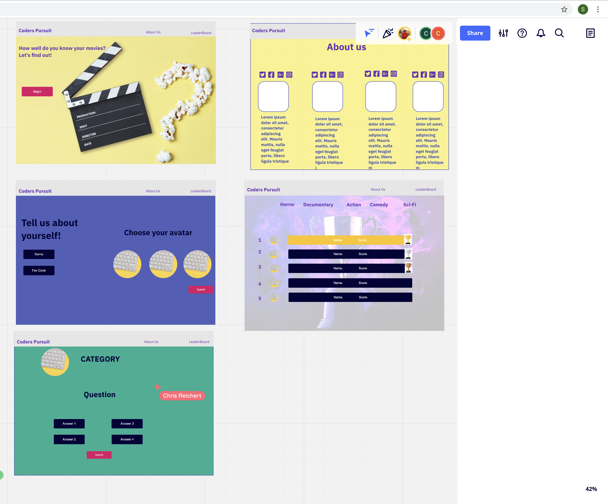
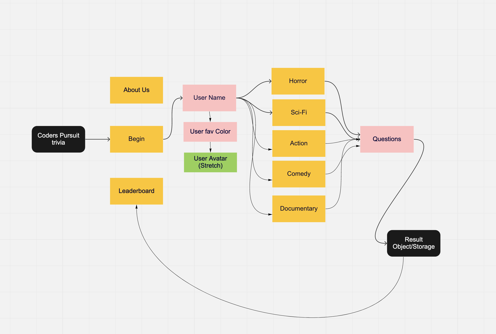
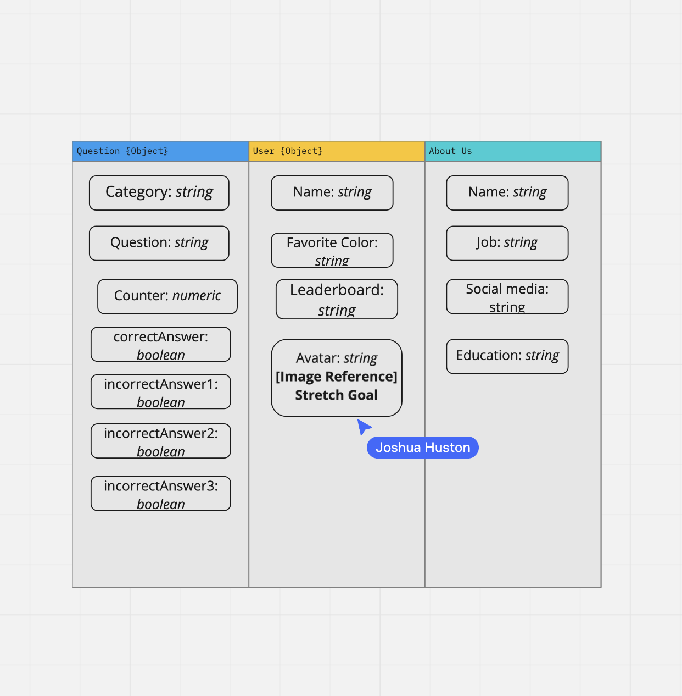

# Movie-Trivia Game

## Members

- Shania Kimbrough
- Chris Reichert
- Joshua Huston
- Chris Rarig

## Description

- add additional games, additional questions(topics)
 Trivia questions (genre)
Trivia pursuit 5 genres; 4 questions per;
Questions right to unlock puzzle piece
All 5 pieces unlock- leader-board (questions Correct and score) can be negative
Randomizer for questions
Animation for unlocked pieces
Increase difficulty
Indicator of users progress

## Categories

- Horror
- Comedy
- Sci-Fi
- Documentary
- Action

## Summation

1. Movie Trivia game with 5 categories and 4 questions

2. Resolves Users’ boredom, Certify that users know their movies

3. MVP: Random 20 Questions, Answers, Leader-board

[Project Managment](https://trello.com/b/tKt9lrsx/coders-puruit-board)
